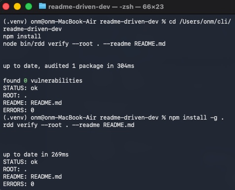

# readme-driven-dev

CLI tool. Compares the README contract with the code inventory.

## About
readme-driven-dev is a CLI tool that automatically checks alignment between the README contract and the code inventory.
The contract is the `rdd-contract`, `rdd-tree`, and `rdd-output` blocks in the README.



## 1. Problem Statement
- README defines commands, flags, environment variables, config files, and folder structure. When code changes, README is not updated. Result: documentation and code drift.
- Existing approaches validate README format or run tests. They do not compare the technical contract in README with the code inventory.

## 2. Solution Approach

### What it does
- Parses the `rdd-contract` block in README.md.
- Parses the `rdd-tree` block in README.md.
- Compares the README contract with the `.rdd/code.json` code inventory.
- Checks every path in `rdd-tree` on disk.
- Compares README output examples with files under `docs/examples/`.
- Produces output in `text` or `json` format.

### What it does not do
- Does not parse source code.
- Does not execute commands to measure runtime behavior.
- Does not generate documentation outside README.
- Does not apply automatic code changes.

## 3. Installation

### Supported operating systems
- macOS 13
- macOS 14
- Ubuntu 22.04 LTS
- Windows 11

### Requirements
- Node.js 20.x
- npm 10.x

### Installation commands
Commands run from the project root directory.

```bash
npm install
npm install -g .
```

## 4. Usage

### Command syntax
```bash
rdd <command> [flag]
```

### Commands
- `verify`: compares the README contract with the code inventory.
- `parse`: writes the README contract to stdout as JSON.

### Global flags
- `-h, --help`: prints help and exits.
- `--version`: prints the version and exits.

### verify flags
- `--root <path>`: repository root. Default value: `.`
- `--readme <path>`: README path. Default value: `README.md`
- `--format <text|json>`: output format. Default value: `text`

### parse flags
- `--root <path>`: repository root. Default value: `.`
- `--readme <path>`: README path. Default value: `README.md`

### Examples

#### Example: verify success
```bash
rdd verify --root . --readme README.md
```

Output ID: verify-success
```rdd-output
STATUS: ok
ROOT: .
README: README.md
ERRORS: 0
```

#### Example: verify failure
```bash
rdd verify --root . --readme README.md
```

Output ID: verify-failure
```rdd-output
STATUS: fail
ROOT: .
README: README.md
ERRORS: 2
- MISSING_PATH docs/examples/verify-failure.txt
- CONTRACT_MISMATCH commands.verify.flags
```

#### Example: parse
```bash
rdd parse --root . --readme README.md
```

Output ID: parse-output
```rdd-output
{
  "globalFlags": ["-h", "--help", "--version"],
  "commands": {
    "verify": { "flags": ["--root", "--readme", "--format"] },
    "parse": { "flags": ["--root", "--readme"] }
  },
  "env": [],
  "configFiles": [".rdd/code.json"],
  "examples": {
    "verify-success": "docs/examples/verify-success.txt",
    "verify-failure": "docs/examples/verify-failure.txt",
    "parse-output": "docs/examples/parse-output.json",
    "verify-json": "docs/examples/verify-json.json"
  }
}
```

## 5. README <-> Code Rules

### Parsed from README
- The `rdd-contract` code block is required. It must be a JSON object. Required fields:
  - `globalFlags`: string array
  - `commands`: object, each command has `flags` as string array
  - `env`: string array
  - `configFiles`: string array, root-relative path
  - `examples`: object, `id` -> root-relative path
- The `rdd-tree` code block is required. Tree format is ASCII and uses `|--` and `\--`.
- `rdd-output` code blocks appear after the `Output ID: <id>` line. `<id>` must exist in `examples`.

`rdd parse` outputs only the `rdd-contract` JSON data. JSON is written with 2-space indentation and a trailing newline.

The `rdd-contract` block in this README:
```rdd-contract
{
  "globalFlags": ["-h", "--help", "--version"],
  "commands": {
    "verify": { "flags": ["--root", "--readme", "--format"] },
    "parse": { "flags": ["--root", "--readme"] }
  },
  "env": [],
  "configFiles": [".rdd/code.json"],
  "examples": {
    "verify-success": "docs/examples/verify-success.txt",
    "verify-failure": "docs/examples/verify-failure.txt",
    "parse-output": "docs/examples/parse-output.json",
    "verify-json": "docs/examples/verify-json.json"
  }
}
```

### Validated from code
- `.rdd/code.json` is required and must be a JSON object.
- `.rdd/code.json` fields:
  - `globalFlags`
  - `commands`
  - `env`
  - `configFiles`
- `globalFlags`, `commands`, `env`, `configFiles` must exactly match the README contract.
- Every path in `configFiles` must exist on disk.
- Every path in `rdd-tree` must exist on disk.
- Every path in `examples` must exist on disk.
- Every `rdd-output` block in README must exactly match the content of the corresponding example file.

`.rdd/code.json` format:
```json
{
  "globalFlags": ["-h", "--help", "--version"],
  "commands": {
    "verify": { "flags": ["--root", "--readme", "--format"] },
    "parse": { "flags": ["--root", "--readme"] }
  },
  "env": [],
  "configFiles": [".rdd/code.json"]
}
```

### Error cases and exit codes
Verify error codes:
- `README_CONTRACT_MISSING`
- `README_CONTRACT_INVALID_JSON`
- `README_TREE_MISSING`
- `CODE_INVENTORY_MISSING`
- `CODE_INVENTORY_INVALID_JSON`
- `CONTRACT_MISMATCH`
- `MISSING_PATH`
- `OUTPUT_MISSING`
- `OUTPUT_MISMATCH`

`rdd verify` exit codes:
- `0`: all checks passed
- `1`: at least one validation error
- `2`: README contract or code inventory invalid
- `3`: internal error

`rdd parse` exit codes:
- `0`: parse successful
- `2`: README contract missing or invalid JSON
- `3`: internal error

## 6. Project Architecture

### Folder structure
```rdd-tree
readme-driven-dev/
|-- README.md
|-- LICENSE
|-- pic.png
|-- package.json
|-- package-lock.json
|-- bin/
|   \-- rdd
|-- src/
|   |-- cli.js
|   |-- contract/
|   |   |-- parse.js
|   |   \-- validate.js
|   |-- code/
|   |   |-- load.js
|   |   \-- compare.js
|   |-- report/
|   |   |-- format-json.js
|   |   \-- format-text.js
|   \-- errors.js
|-- .rdd/
|   \-- code.json
\-- docs/
    \-- examples/
        |-- parse-output.json
        |-- verify-failure.txt
        |-- verify-json.json
        \-- verify-success.txt
```

### Modules and responsibilities
- `bin/rdd`: CLI entry point and command dispatch.
- `src/cli.js`: argument parsing and command invocation.
- `src/contract/parse.js`: parses the README contract.
- `src/contract/validate.js`: validates contract fields.
- `src/code/load.js`: reads `.rdd/code.json`.
- `src/code/compare.js`: compares README contract with code inventory.
- `src/report/format-text.js`: produces text output.
- `src/report/format-json.js`: produces JSON output.
- `src/errors.js`: error codes and message templates.

## 7. CI / Automation
The following command runs in CI:

```bash
rdd verify --root . --readme README.md --format json
```

JSON output format:
- `status`: `ok` or `fail`
- `root`: string
- `readme`: string
- `errors`: object array, each element has `code` and `detail`

Output ID: verify-json
```rdd-output
{
  "status": "fail",
  "root": ".",
  "readme": "README.md",
  "errors": [
    { "code": "MISSING_PATH", "detail": "docs/examples/verify-failure.txt" }
  ]
}
```

## 8. Roadmap
- v1: README contract parsing, code.json comparison, tree and output validation, text and JSON reports.
- v1.1: deterministic JSON field order and stable error ordering.
- v2: extract commands and flags from source code for Node.js and Go.
